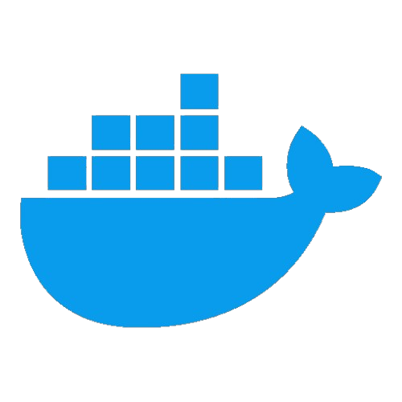
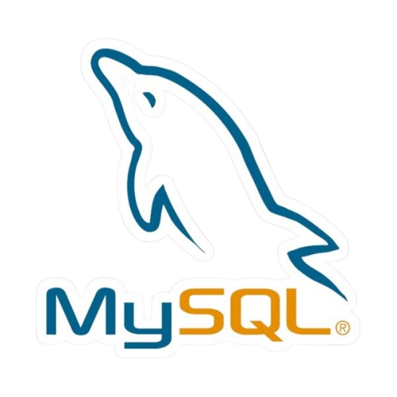
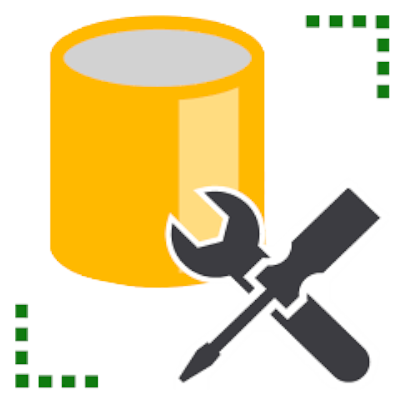

<h1 align="center">👋 Hi there!, I'm Ashan Salinda</h1>

<i>- A passionate developer and tech enthusiast -</i>
 

    

     

***🌐 &ensp;Web Developer:*** &ensp;&ensp;&ensp;&ensp;&ensp;Experienced in HTML, CSS, JavaScript, and modern frameworks like React.js.

***📱 &ensp;Mobile Developer:*** &ensp;&ensp;&ensp;Skilled in building responsive and intuitive mobile applications using React Native.

***🛠️ &ensp;Backend Developer:***&ensp;&ensp;Proficient in Node.js, Express, and working with databases like MongoDB and PostgreSQL.

***🖥️ &ensp;Programmer:*** &ensp;&ensp;&ensp;&ensp;&ensp;&ensp;&ensp;Skilled in Python, Java, and C++, focusing on clean and efficient code.

***🎨 &ensp;UI/UX Designer:***&ensp;&ensp;&ensp;&ensp;&ensp;Crafting seamless and intuitive user experiences with a touch of creativity.

***🚀 &ensp;Forward Thinker:*** &ensp;&ensp;&ensp;&ensp;Taste for creating innovative solutions and embracing challenging projects.

***💡 &ensp;Problem Solver:*** &ensp;&ensp;&ensp;&ensp;&ensp;Enjoy solving complex problems and optimizing performance.

***📚 &ensp;Lifelong Learner:*** &ensp;&ensp;&ensp;&ensp;Continuously learning and exploring new technologies to stay updated.

  

<h2 align="left">Skills :</h2>  

    &nbsp;&nbsp;&nbsp;&nbsp;
    &nbsp;&nbsp;&nbsp;&nbsp;
    &nbsp;&nbsp;&nbsp;&nbsp;
    &nbsp;&nbsp;&nbsp;&nbsp;
    &nbsp;&nbsp;&nbsp;&nbsp;
    &nbsp;&nbsp;&nbsp;&nbsp;
    &nbsp;&nbsp;&nbsp;&nbsp;
    &nbsp;&nbsp;&nbsp;&nbsp;
    &nbsp;&nbsp;&nbsp;&nbsp;
    &nbsp;&nbsp;&nbsp;&nbsp;
    &nbsp;&nbsp;&nbsp;&nbsp;
    &nbsp;&nbsp;&nbsp;&nbsp;
    &nbsp;&nbsp;&nbsp;&nbsp;
    &nbsp;&nbsp;&nbsp;&nbsp;
    &nbsp;&nbsp;&nbsp;&nbsp;
    &nbsp;&nbsp;&nbsp;&nbsp;
    &nbsp;&nbsp;&nbsp;&nbsp;
    &nbsp;&nbsp;&nbsp;&nbsp;
    &nbsp;&nbsp;&nbsp;&nbsp;
    &nbsp;&nbsp;&nbsp;&nbsp;
    &nbsp;&nbsp;&nbsp;&nbsp;
    &nbsp;&nbsp;&nbsp;&nbsp;

    

<h2>Connect with me :</h2>

      &nbsp;
      &nbsp;
      &nbsp;&nbsp;
      &nbsp;
      

      

    

<h2>Insights :</h2>
 

       
        

 
  

 

